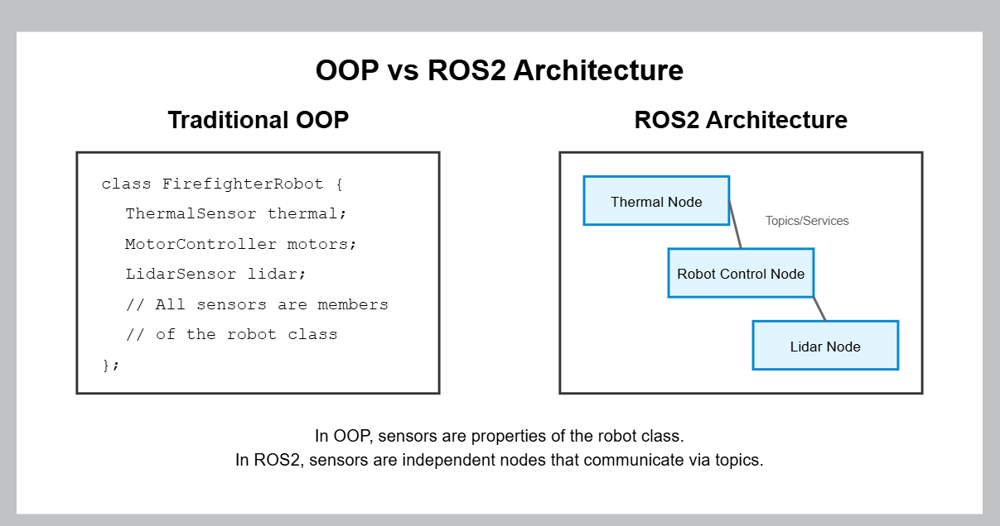

1. The .hpp clearly shows the node's interface/capabilities
2. Implementation details are separated in the .cpp
3. Each node is its own class, keeping related functionality together

1. Physical Layout (URDF):
   - URDF defines where everything is mounted on the robot
   - Uses links and joints to specify physical relationships
   - Handles transformations (tf2)

2. Software Architecture (ROS2 Nodes):
   - Sensors operate as independent nodes, not properties of the robot
   - Nodes communicate via topics and services
   - Physical mounting (URDF) is separate from functional behavior (nodes)

This separation lets you easily swap hardware or run simulations while keeping the same code structure.

Conventional Programming OOP
1. Firefighter Robot is a Class
2. It contains a sensor class object such as: "ThermalSensor thermal" as a variable
3. Refer to ROSARCHITECTURE.png in ~/robotics/Helios

